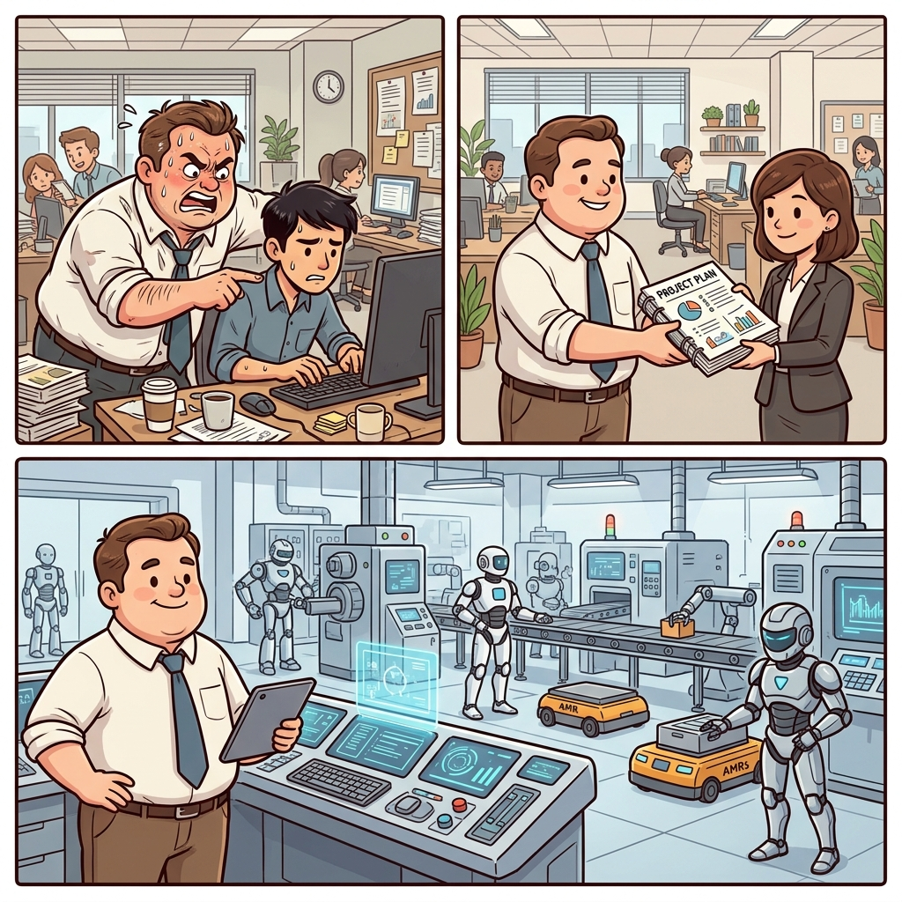
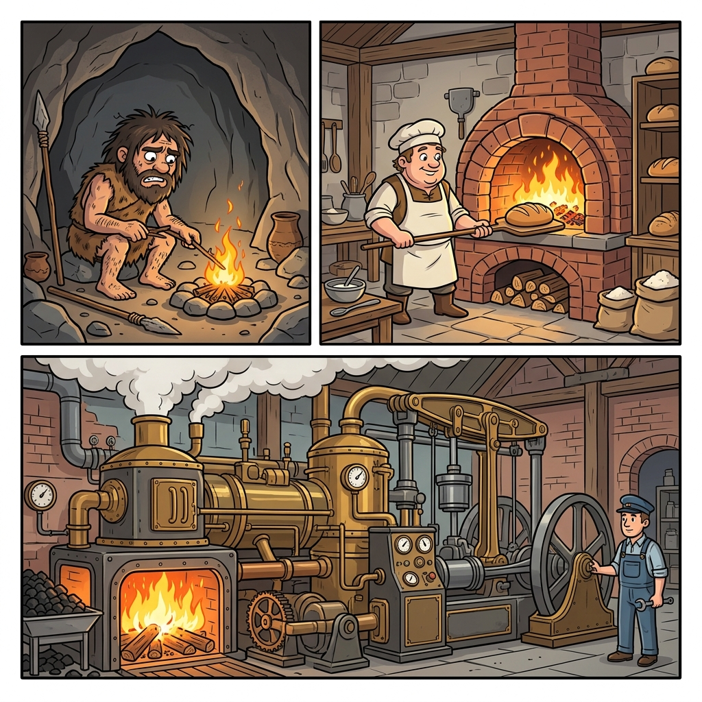

三年时间，我们与 AI 协作的方式经历了三次本质跃迁：Prompt Engineering → Context Engineering → Harness Engineering。这不是行业在制造焦虑或堆砌新词，而是模型能力每上一个台阶，旧的协作方式就不够用了，我们不得不找到新的方法来驾驭更强大的 AI。

理解这三次进化最好的方式，不是去记定义，而是搞清楚每个阶段我们和 AI 之间的关系到底发生了什么变化。

## 一个直觉类比

在展开细节之前，先用一个所有人都能理解的场景来建立直觉。

想象你在管理一个团队：

**第一阶段——你事必躬亲。** 每件事你都得亲自交代清楚，写邮件你得逐字逐句告诉他怎么写，改代码你得指着屏幕说改哪一行。他做一步你说一步，你不说他就停。这就是 **Prompt Engineering**。

**第二阶段——你学会了写文档。** 团队成员变聪明了，不需要你手把手带了。但你发现，如果你不把项目背景、技术栈、代码规范这些信息整理好给他，他做出来的东西还是会偏。于是你的核心工作变成了：在他开始干活之前，把最关键的信息精准地喂给他。这就是 **Context Engineering**。

**第三阶段——你在搭管理体系。** 团队规模爆炸了，每个人都很能干，但你不可能盯着每个人的每一个动作。你开始搭制度：代码规范、CI/CD 流水线、自动化测试、Code Review 流程。你不再告诉他们"怎么做"，而是构建一套系统，让他们在这套系统里自主运转还不会出大问题。这就是 **Harness Engineering**。

从一对一指导，到信息管理，到体系建设。人没变，变的是协作对象的能力越来越强，你需要的管理方式也越来越"系统化"。



## 第一阶段：Prompt Engineering（2023）

2022 年底 ChatGPT 横空出世，所有人都在研究同一个问题：**怎么问 AI，才能得到好答案？**

那时候的模型不够聪明，输出质量极度依赖你的提问方式。同一个需求，换一种问法，结果天差地别：

```
❌ "帮我写一篇关于 AI 的文章"
→ 正确但毫无灵魂的废话

✅ "你是一个科技领域的资深记者，擅长用类比解释复杂概念。
   写一篇 3000 字的文章，主题是 AI 对普通人生活的影响，
   要有具体案例，语气口语化，不要太正式。"
→ 质量完全不同
```

这就是 Prompt Engineering 的核心：**通过精心设计输入，来约束输出质量。** 你在雕琢的是"怎么说"这件事本身。角色设定、Few-shot 示例、Chain of Thought……所有技巧都围绕着一个目标——把问题问得更好。

当时硅谷甚至开出了年薪 30 万美金的 Prompt Engineer 岗位。那个年代，"会问问题"真的是一种稀缺能力。

## 第二阶段：Context Engineering（2024-2025）

2024 年下半年开始，一个趋势越来越明显：**模型变聪明了，Prompt 技巧的边际收益在急速下降。**

[Claude](https://claude.ai/) 3.5 Sonnet 出来的时候，你随便跟它说句话，它都能理解你的意思。你不用再像伺候大爷一样去雕琢每个词了。问题变成了：**AI 理解力够了，但它手里有没有足够的信息来做好这件事？**

2025 年中，[Andrej Karpathy](https://karpathy.ai/) 转发了一条推文，大意是：在工业级 AI 应用里，真正的工程活不是在雕花一个 Prompt，而是精心设计 AI 的上下文窗口里到底该塞什么信息。

一个典型的例子：你让 AI 帮你改一段代码。

- 只给它这段代码 → 改得乱七八糟
- 同时给它所在文件、依赖关系、技术栈说明、团队编码规范 → 质量高几个量级

Context Engineering 解决的核心问题就是：**在有限的上下文空间里，如何精准地给模型最关键的信息。** 你不再纠结"怎么说"，而是思考"给它看什么"。

这就像一个厨师备菜的过程——食材选对了、切好了、配好了，下锅翻炒只是最后一步。

## 第三阶段：Harness Engineering（2026-今）

又过了大半年，Harness Engineering 登场了。

这个词进入视野，最早可以追溯到 2025 年 11 月 [Anthropic](https://www.anthropic.com/) 的一篇博客，他们把 Claude Agent SDK 称为"一个强大的通用 Agent Harness"。2026 年 2 月，[OpenAI](https://openai.com/) 一篇标题里直接写上了 Harness Engineering 的文章引爆了讨论。

那篇文章讲了什么？OpenAI 内部一个团队用五个月时间，用 Codex 构建了一个接近百万行代码的产品。**人类手写的代码量是 0 行。** 人类工程师做的全部工作就是：设计架构边界、制定依赖规则、写自动化测试、配置 lint 规则、搭建 CI/CD 流水线、设计反馈循环。

他们在搭建一个**让 AI Agent 能安全、高效、可控地自主运行的系统**。这个系统，就是 Harness。

### Harness 这个词的由来

Harness 来源于马具——马鞍、缰绳、嚼子那一整套装备。马是一种速度快、力量大的动物，但不给它套上缰绳，它大概率会跑偏，甚至把你甩下来。

现在的 AI 模型就是这匹马。它能写代码、做分析、调用工具、自主决策，能力已经极其强大。但不给它套上 Harness，它就会跑偏、会犯错、会在你不知道的地方挖坑。

所以 2026 年到目前为止，关于 AI 工程最精辟的一句公式：

> **Agent = Model + Harness**

模型是马，Harness 是缰绳。光有马不行，你还得有一整套驾驭它的系统。

### Harness 的两个核心机制

一个好的 Harness 由两类控制组成：

**引导（Guides / 前馈控制）**——在 AI 行动之前，提前设好规则，让它沿着正确方向走。就像高速公路上的护栏，你不需要每秒去纠正司机。具体包括：

- 代码规范文档（CLAUDE.md、.cursorrules）
- 架构决策记录
- 角色与权限边界定义
- 工作流模板

**检测器（Sensors / 反馈控制）**——在 AI 做完事之后，用各种手段检测它做得对不对。具体包括：

- 自动化测试
- 代码 lint / 静态分析
- CI/CD 流水线
- Code Review 机制

引导防患于未然，检测器亡羊补牢。两者组合形成闭环：**每当你发现 Agent 犯了一个错误，你就设计一个机制，让它永远不可能再犯同样的错误。**

## 与每个人都有关

Harness Engineering 听起来很"工程"，但它的思维方式其实是普适的。

你让 AI 帮你写邮件，事先告诉它"永远不要用感叹号结尾""收件人是老板时语气要正式""涉及数字要反复核实"——这就是你的 Harness。

你在 CLAUDE.md 里写下项目规范，让 AI 每次写代码都自动遵守——这也是 Harness。

本质上，Harness Engineering 要求你思考一个问题：**怎么设计一套系统，让你不用盯着的时候，AI 也能自己跑起来还不出大问题？**

## 从火焰到蒸汽机

回头来看，这三次跃迁其实映射的是一个古老的命题：**当一股力量比你更快、更强、更自主的时候，你怎么让它为你所用？**



- 最早人类学会用火，每一刻都得小心翼翼地喂柴，火太小不行，太大也不行。你的每一次输入直接决定输出。这是 **Prompt Engineering**。


- 后来人类建了炉子，把火关在一个结构里，通过进气口和烟囱来控制火势。你通过设计结构来影响行为。这是 **Context Engineering**。
  


- 再后来人类发明了蒸汽机，火在一个精密的系统里自动运行，有锅炉、气缸、安全阀、调速器。你不再直接操控火，而是维护这套系统。这是 **Harness Engineering**。


从火焰到蒸汽机，人类花了几千年。从 Prompt Engineering 到 Harness Engineering，AI 只花了三年。

速度变了，但本质没变。Harness Engineering 不是什么全新的概念，它就是人类几千年来一直在做的那件事——**把一股不受控的力量，安全地、持续地、可复制地，引导到我们想要的方向上去。**
